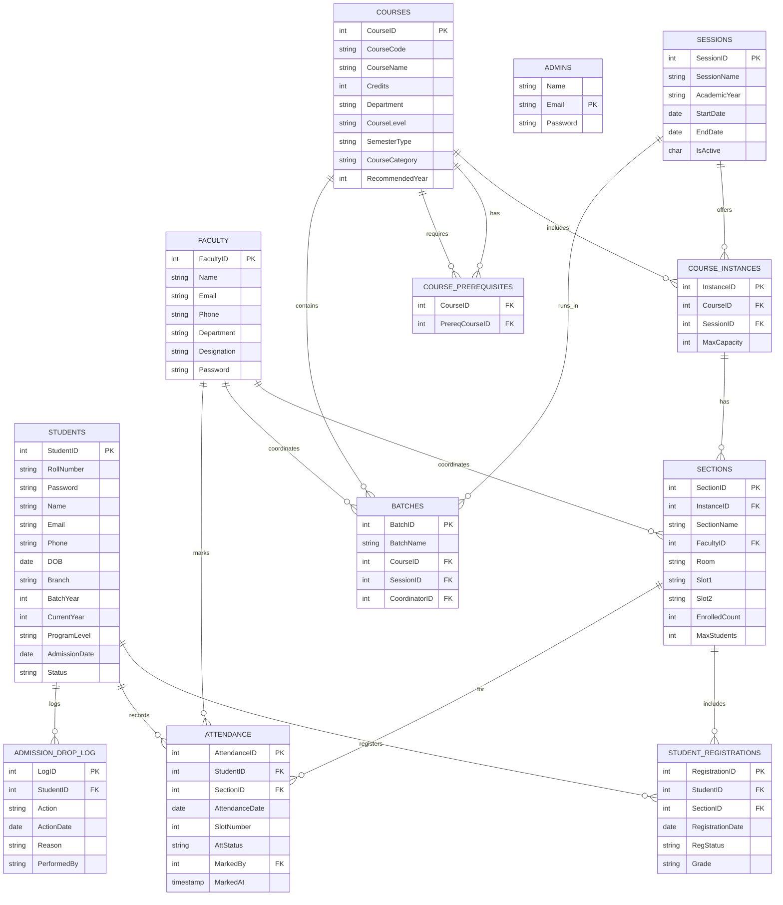

# attendX ER Diagram

This ER diagram represents the core entities and relationships in the attendX Student Attendance & Registration System.

```mermaid
erDiagram
    SESSIONS {
        int SessionID PK
        string SessionName
        string AcademicYear
        date StartDate
        date EndDate
        char IsActive
    }
    FACULTY {
        int FacultyID PK
        string Name
        string Email
        string Phone
        string Department
        string Designation
        string Password
    }
    ADMINS {
        string Name
        string Email PK
        string Password
    }
    COURSES {
        int CourseID PK
        string CourseCode
        string CourseName
        int Credits
        string Department
        string CourseLevel
        string SemesterType
        string CourseCategory
        int RecommendedYear
    }
    COURSE_PREREQUISITES {
        int CourseID FK
        int PrereqCourseID FK
    }
    STUDENTS {
        int StudentID PK
        string RollNumber
        string Password
        string Name
        string Email
        string Phone
        date DOB
        string Branch
        int BatchYear
        int CurrentYear
        string ProgramLevel
        date AdmissionDate
        string Status
    }
    COURSE_INSTANCES {
        int InstanceID PK
        int CourseID FK
        int SessionID FK
        int MaxCapacity
    }
    SECTIONS {
        int SectionID PK
        int InstanceID FK
        string SectionName
        int FacultyID FK
        string Room
        string Slot1
        string Slot2
        int EnrolledCount
        int MaxStudents
    }
    BATCHES {
        int BatchID PK
        string BatchName
        int CourseID FK
        int SessionID FK
        int CoordinatorID FK
    }
    STUDENT_REGISTRATIONS {
        int RegistrationID PK
        int StudentID FK
        int SectionID FK
        date RegistrationDate
        string RegStatus
        string Grade
    }
    ATTENDANCE {
        int AttendanceID PK
        int StudentID FK
        int SectionID FK
        date AttendanceDate
        int SlotNumber
        string AttStatus
        int MarkedBy FK
        timestamp MarkedAt
    }
    ADMISSION_DROP_LOG {
        int LogID PK
        int StudentID FK
        string Action
        date ActionDate
        string Reason
        string PerformedBy
    }

    SESSIONS ||--o{ COURSE_INSTANCES : "offers"
    COURSES ||--o{ COURSE_INSTANCES : "includes"
    COURSES ||--o{ COURSE_PREREQUISITES : "has"
    COURSES ||--o{ COURSE_PREREQUISITES : "requires"
    COURSE_INSTANCES ||--o{ SECTIONS : "has"
    FACULTY ||--o{ SECTIONS : "coordinates"
    COURSES ||--o{ BATCHES : "contains"
    SESSIONS ||--o{ BATCHES : "runs_in"
    FACULTY ||--o{ BATCHES : "coordinates"
    STUDENTS ||--o{ STUDENT_REGISTRATIONS : "registers"
    SECTIONS ||--o{ STUDENT_REGISTRATIONS : "includes"
    STUDENTS ||--o{ ATTENDANCE : "records"
    SECTIONS ||--o{ ATTENDANCE : "for"
    FACULTY ||--o{ ATTENDANCE : "marks"
    STUDENTS ||--o{ ADMISSION_DROP_LOG : "logs"
```
