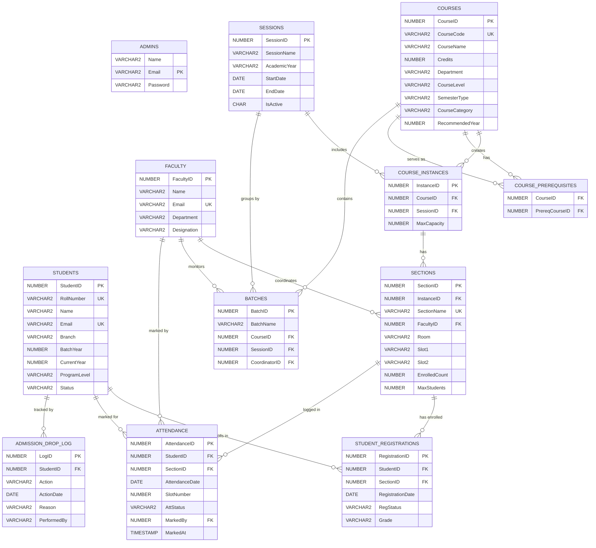

# Entity Relationship Diagram

The following ER diagram maps the primary relationships and schema structure of the `Student Attendance & Registration System`.

## Description of Key Relationships

1. **Course Structure**: A `COURSE` combined with a `SESSION` forms a `COURSE_INSTANCE` (e.g. "Intro to Programming" in "Even Semester 24-25"). 
2. **Sections**: A `COURSE_INSTANCE` is broken down into `SECTIONS`. A `FACULTY` member handles each section, and students enroll directly into specific `SECTIONS` via `STUDENT_REGISTRATIONS`.
3. **Attendance Tracking**: `ATTENDANCE` acts as a log entry linking a `STUDENT` and a `SECTION` for a specific day and time slot. `FACULTY` members are associated as the marker of this attendance.
4. **Lifecycle Logs**: The `ADMISSION_DROP_LOG` tracks major lifecycle changes for a student independent of specific courses.
